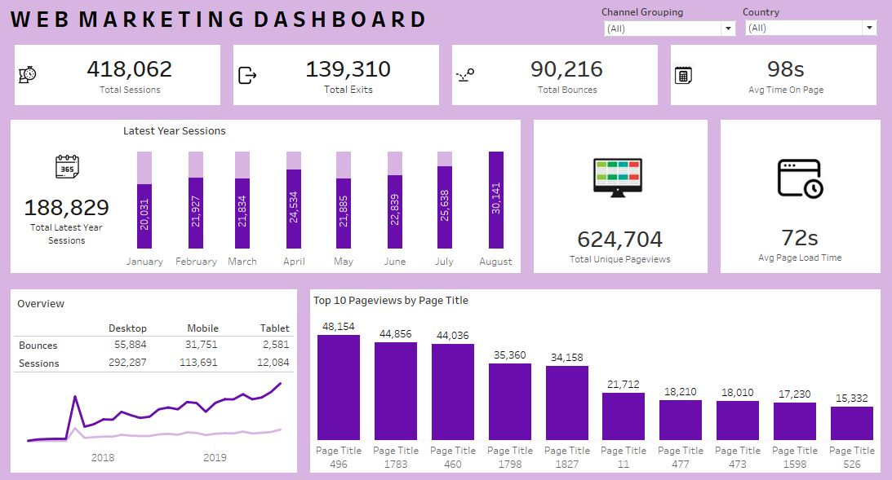

# Web Marketing Analysis

## Project Overview:
In this project, I developed a comprehensive Web Marketing Dashboard using Tableau to track, analyze, and interpret key web performance metrics for effective decision-making. The dashboard provides a detailed view of session activity, bounce rates, page views, and user behavior across devices, making it easier to monitor web traffic trends and identify areas for improvement in the user journey.

#### Tool Used: Tableau

## Dashboard

## Dashboard Breakdown

### 1. Key Performance Indicators (KPIs)

The top section of the dashboard provides essential KPIs for high-level monitoring:

- **Total Sessions:** 418,062 – Indicates the total number of visits to the website.
- **Total Exits:** 139,310 – Shows the number of times users exited the site.
- **Total Bounces:** 90,216 – Represents the number of sessions where users left after viewing a single page.
- **Average Time on Page:** 98 seconds – Measures the average time users spent on individual pages.
- **Total Unique Pageviews:** 624,704 – Captures unique views across pages, representing user engagement.
- **Average Page Load Time:** 72 seconds – Indicates how quickly pages load on average, which impacts user satisfaction.

### 2. Monthly Session Trends

The “Latest Year Sessions” bar chart presents monthly web session data:

- January through August shows relatively stable monthly sessions, with the highest number (30,141) in August.
- Seasonal trends and peak months can be observed, which may reflect successful campaigns or events driving more traffic.

### 3. Device Overview

The “Overview” section provides insights into user behavior based on the device used:

- **Desktop:** 292,287 sessions and 55,884 bounces
- **Mobile:** 113,691 sessions and 31,751 bounces
- **Tablet:** 12,084 sessions and 2,581 bounces

Desktop users dominate the traffic, though mobile has a significant share, suggesting the need for a mobile-optimized experience.

### 4. Top Pageviews by Page Title

This bar chart displays the top 10 page titles by page views, highlighting the most visited pages.

- The most popular page has 48,154 views, while other top pages range from 15,000 to 45,000 views.
- Identifying high-traffic pages helps in content prioritization and resource allocation for further enhancement.

### 5. Traffic Overview Over Time

The line graph in the bottom left tracks session trends over 2018 and 2019, providing a historical view of user engagement.

## Vital Insights and Observations

- **User Engagement:** The high number of unique pageviews (624,704) indicates strong user interest and engagement with site content.
- **Bounce Rate and Exits:** With 90,216 bounces and 139,310 exits, understanding which pages have the highest bounce and exit rates could inform adjustments in content strategy or design.
- **Average Page Load Time:** At 72 seconds, the page load time is relatively high. Reducing load time could improve user experience and decrease bounce rates.
- **Device Usage:** While desktop users represent the majority, mobile traffic is significant, warranting a continued focus on optimizing the mobile experience.
- **Page Popularity:** The top 10 pages account for a significant portion of overall views, suggesting that they are critical touchpoints in the user journey and should be prioritized for content updates and optimization.

## Recommendations

1. **Improve Page Load Time:** Lower the average page load time from 72 seconds to improve user satisfaction and reduce bounce rates, particularly for mobile users where slower load times can impact retention.
2. **Optimize Mobile Experience:** Given the significant share of mobile users, consider optimizing site performance, navigation, and layout for mobile devices to boost engagement.
3. **Content Strategy for High-Bounce Pages:** Identify pages with high bounce rates and evaluate them for improvements. Adjust content and design to encourage users to explore more of the site.
4. **Focus on High-Engagement Pages:** Use the insights from the top 10 pageviews to create content that aligns with what users find valuable and engaging, potentially replicating successful elements across other pages.
5. **Seasonal Campaign Planning:** Based on the monthly session trends, plan marketing campaigns around peak months like August to capitalize on natural traffic increases.

## Conclusion
This documentation provides a comprehensive view of the Web Marketing Analysis and highlights the insights and recommendations for potential improvements. The dashboard showcases my ability to leverage Tableau for web traffic analysis, derive actionable insights, and create data-driven recommendations to enhance user engagement and optimize website performance.

